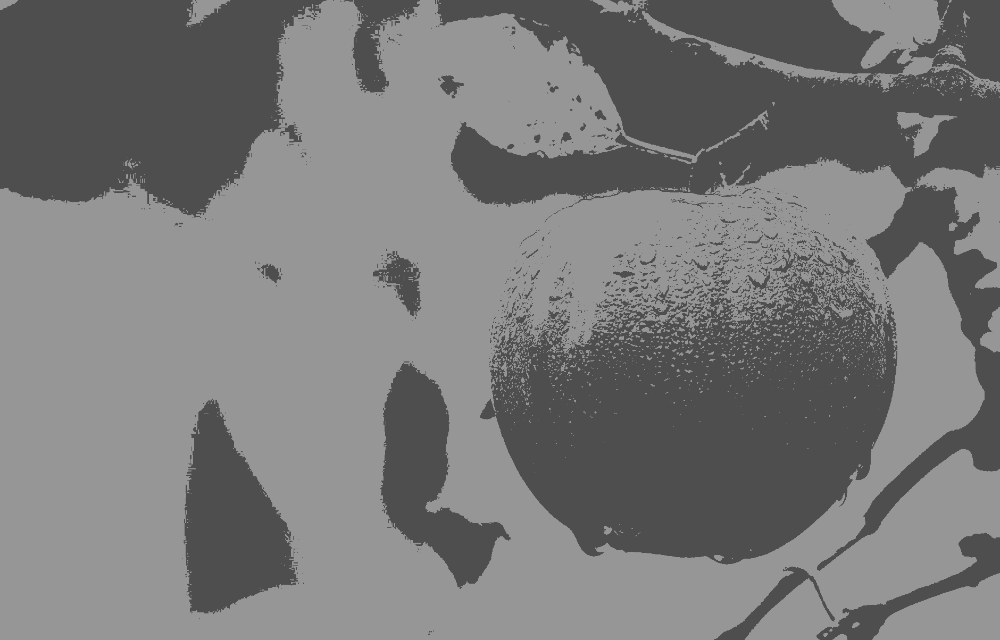

# Image Segmentation Using K-Means Clustering

This is the implementation for Image segmentation using k-means clustering and subtractive clustering algorithms. The research paper can be found here [Link](https://www.sciencedirect.com/science/article/pii/S1877050915014143?via%3Dihub)


## Theory
Image segmentation: It's a classification of the image into different groups. There are various methods to do image segmentation. One of the popular machine learning algorithms to do image segmentation is K-Means clustering.

K-Means Clustering: Is an unsupervised learning algoritm which would assign the data into k clusters with the nearest mean.


## Installations

```bash
git clone https://github.com/shubham-pyc/Image-Segmentation.git
```

```bash
./compile
```

## Implementation details k-means

Below are the approaches used to implement the k-means algorithm. For all the implementations initial means were used with subtractive clustering algorithm. (`more details in the paper`)
1. OMP: For shared memory environment each thread had it's own sum of pixels assigned to clusters and counts of those clusters. Once all the pixels were assigned to their respective clusters. All threads will aggrigated their local counts to finally count the new centroids. (`Implementaion for this can be found at: line 95 ./include/kmeans.h`)
2. MPI: For distributed memory environment each process has it's own sum of pixels and counts same as MPI. After each iterations all the sums and counts are reduced to node: 0. On node 0 the new centroids are calculated and then again broadcasted. In last iteration the assignments for each pixels are gathered and image is reconstructed.
3. CUDA: Pixel data is converted to thrust vectors. It's passed to kernel to compute best clusters for each pixel. After that atomicAdd is used to reduce all the allocations. Each block has 1024 threads and number of blocks are = data_size /1024

## How to run
There are 4 types of k-means implementations in this project
1. Serialized 
```bash
./kmean.out serial #runs the k-means in serial
```
2. Multithreaded using OMP
   
```bash
./kmeans.out omp #runs the k-means with omp implementaion
```

3. GPU using Cuda
```bash
./kmeans.out cuda #runs the k-means with cuda implementation
```

4. Distributed Memory using MPI
```bash
mpirun -np 8 ./kmeans mpi #runs the k-means with MPI implemenation with 8 cores
```

## Code Instructions

1. Changing input file. This can be changed from file (`line 29 /include/utils.h`)
1. Changing output file. This can be changed from file (`line 47 /include/utils.h`)


## Results

<!--  -->


<br>


<br>



## References
1. [Exploring K-Means in Pyhton,C++ and Cuda](http://www.goldsborough.me/c++/python/cuda/2017/09/10/20-32-46-exploring_k-means_in_python,_c++_and_cuda/)
2. [Implementing k-means clustering from scratch in C++](https://reasonabledeviations.com/2019/10/02/k-means-in-cpp/) 
3. [Image segmentation using k-means clustering and subtractive clustering algorithms](https://www.sciencedirect.com/science/article/pii/S1877050915014143?via%3Dihub)
4. [MPI Reduce and Allreduce](https://mpitutorial.com/tutorials/mpi-reduce-and-allreduce/)
5. [MPI Scatter, Gather, and Allgather](https://mpitutorial.com/tutorials/mpi-scatter-gather-and-allgather/)


## Image References
1. Google