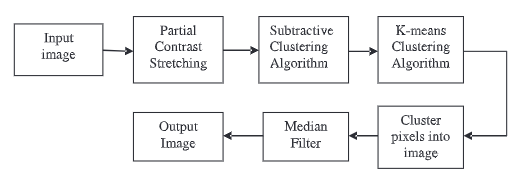

# Image Segmentation Using K-Means Clustering

This is the implementation for Image segmentation using k-means clustering and subtractive clustering algorithms. The research paper can be found here [Link](https://www.sciencedirect.com/science/article/pii/S1877050915014143?via%3Dihub)


## Theory
Image segmentation: It's a classification of the image into different groups. There are various methods to do image segmentation. One of the popular machine learning algorithms to do image segmentation is K-Means clustering.

K-Means Clustering: Is an unsupervised learning algoritm which would assign the data into k clusters with the nearest mean.



## Installations

```shell
git clone https://github.com/shubham-pyc/Image-Segmentation.git
```

```shell
./compile
mpirun -np 4 kmeans.out 1
```

## References
1. [Exploring K-Means in PYhton,C++ and Cuda](http://www.goldsborough.me/c++/python/cuda/2017/09/10/20-32-46-exploring_k-means_in_python,_c++_and_cuda/)
2.[Implementing k-means clustering from scratch in C++](https://reasonabledeviations.com/2019/10/02/k-means-in-cpp/) 